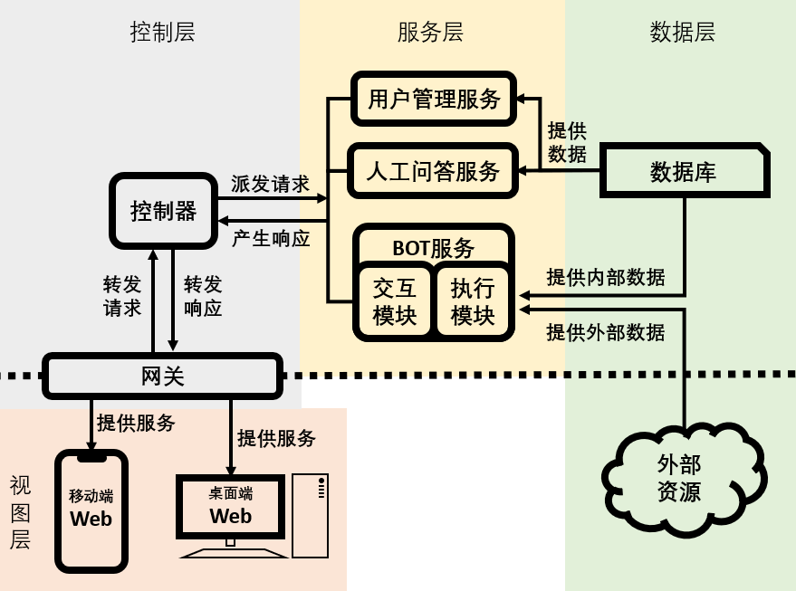

# 技术规格说明书

## 一、技术栈

### 1. 前端

* 语言：HTML + CSS + JavaScript
* 框架：Vue.js
* 运行环境：Web浏览器

### 2. 后端

* 语言：C#
* 网关：Nginx
* 框架：
  * [ASP.NET Core](https://docs.microsoft.com/zh-cn/aspnet/core/?view=aspnetcore-5.0)：用于创建Web API，提供网络服务，是整个后端的基础框架；
  * [Bot Framework for .NET](https://docs.microsoft.com/zh-cn/azure/bot-service/index-bf-sdk?view=azure-bot-service-4.0)：提供BOT相关支持，作为BOT部分主要依赖的框架；
  * [Entity Framework Core](https://docs.microsoft.com/en-us/ef/core/)：提供数据库访问的支持；
* 运行环境：Linux服务器，将使用云服务器，同时需要具备`.NET Core 3.1`运行时环境


## 二、软件的总体框架

### 1. 总体结构



将整个系统分为4个子系统，每个子系统相对独立，且内部实现对外是透明的。控制层作为逻辑的控制中心，除了请求和响应的派发、转发，还需要进行错误处理、绝大部分的日志记录（利用[Microsoft.Extensions.Logging](https://docs.microsoft.com/zh-cn/dotnet/api/microsoft.extensions.logging?view=dotnet-plat-ext-5.0)进行），并保证整个系统不会陷入不可用状态。

这几乎是一个典型的MVC结构，但是有一些方面比较特殊：

1. 由于BOT服务经常需要依赖外部数据来提供服务，所以数据层除了常规的数据库，还需要外部资源；
2. BOT服务的执行模块，除了会进行数据检索这类常规任务，还可能替代用户执行一些操作，还可能向人工问答服务中添加新的提问，它不仅属于服务提供方，也具有一定服务使用方的属性（上图中因为表示不方便未能展示）；
3. BOT服务可以承接绝大多数功能，通过BOT与用户的文字交流具有很大的灵活性，使得只需要后端开发为BOT服务添加新的功能，不需要更改前端和`Web API`就可以添加新的功能；

### 2. 包含的子系统

#### 2.1 视图层

##### 2.1.1 承担的功能任务

软件系统与外界进行交互的主体。

主要获取用户输入并向后端发送请求、对后端提供的模型进行渲染并提供给用户、接收后端提供的服务并响应给用户。

这部分要求提供兼容移动端以及网页端的web。

##### 2.1.2 包含的模块

1. 账号管理页面

   向用户提供包括账号注册，账号找回等账号维护功能。

2. 机器人问答页面

   向用户提供与机器人交互的主要页面。提供的功能包括回答用户提问，提示用户精确提问内容，引导用户将问题发送到提问去。

3. 用户问答页面

   向用户提供提出问题、浏览问题、回答问题以及其他一些与问答有关的交互的功能。

#### 2.2 控制层

##### 2.2.1 承担的功能任务

接收由前端（视图层）发来的请求，并进行安全控制，包括权限检查、错误处理等。

对筛选后的请求进行分发，将它们派发到服务层中的不同服务中去。同时也接收服务层产生的响应，并向前端进行转发。

##### 2.2.2 包含的模块

1. 网关

   网关模块使用Nginx进行反向代理。这样做的好处包括：

   + 使得内部服务器对外部网络来说是透明的，进而提高内部服务器的安全性。
   + 可以在反向代理中设置缓冲，提高用户的访问速度。
   + 通过配置访问控制策略，可以过滤恶意骚扰与访问。

2. 控制器

   从网关获取转发来的用户请求，对请求进行分析检查，对于有问题的请求进行报错。否则，在分析后将其指派给服务层中的不同服务；同时接收汇总服务层产生的响应并转发给网关，通过网关把响应交付给用户。

#### 2.3 服务层

##### 2.3.1 承担的功能任务

软件系统中负责处理用户请求的主要区域，包含主要的处理逻辑。

从控制层接收请求，对请求进行处理，并根据数据层提供的数据来对请求进行相应的反馈。

##### 2.3.2 包含的模块

1. 用户管理服务

   用户管理服务对应前端的用户管理页面。处理用户有关维护账户信息的请求，包括：创建账户、找回账户、账户登录与退出、变更账户信息等。根据请求的不同情形做出不同的回应，并再向数据层请求更新数据库内容。

2. BOT服务

   BOT服务对应前端的机器人问答页面，分析用户发来的聊天信息与提问信息并做出反馈。如果无法提供令人满意的回复，则会对问题进行包装转交给人工问答服务进行提问，并向用户反馈问题链接。

   1. 交互模块

      * 处理与用户聊天过程中比较简单的部分；
      * 对于可以不需要其他信息直接进行的对话与提问，由该模块直接负责，但如果遇到比较复杂的问题，或问题需要关联到其他信息，则将问题转交于执行模块处理；
      * 通过提供选项、主动询问信息等方式引导用户提供足够的信息，以进行准确的检索，或为人工回答提供足够的信息；
      * 面对意料之外的用户输入，不能陷入不可用状态，并且要引导用户进行正确输入；

   2. 执行模块

      处理从交互模块传递来的较为复杂的问题，通过对问题的分析并综合从数据层获取的数据给出反馈。同样，该模块如果也认为不能给出满意答复，则会再人工问答服务中创建问题。

3. 人工问答服务

   人工问答服务对应于前端的用户问答页面。

   人工问答服务提供的功能就与用户问答页面相对应，对于用户主动提出的问题、从BOT服务转发过来的经过包装的问题以及浏览问题信息、对问题做出解答，都由该服务负责处理。

   同时也需做好与与数据层的沟通。

#### 2.4 数据层

##### 2.4.1 承担的功能任务

数据层负责维护数据库以及关联外部资源。

根据服务层任务的不同，数据层的工作包括：

+ 根据服务层的指示更新数据库。
+ 从数据库中获取数据并提供给服务层。
+ 从关联的外部数据中获取数据并提供给服务层。

##### 2.4.2 包含的模块

1. 数据库

   储存所有内部数据。并提供典型的增删查改接口。

2. 外部资源

   所有可以关联到的外部数据的统称，主要是提供额外的补充信息。


## 三、功能的详细设计

**暂未进行，将在实现阶段补充**

## 四、数据库与API接口设计

### 1. 数据库设计

**暂未进行，将在实现阶段补充**

### 2. API接口设计

具体设计见[前后端接口说明书](前后端接口说明书.md)


为保证安全性，所有接口请使用https访问，将考虑禁用所有http访问。

权限分为三种：`游客`、`用户`、`管理员`，权限等级依次提高，权限较高的用户可以进行全校较低的用户的操作。其中`用户`以上的权限需要登录获得，在请求相关方式时，请求头中需包含`Authorization`项，值为`Bearer {token}`，其中`token`为登录成功后服务器返回的[RFC7519 - JWT](https://tools.ietf.org/html/rfc7519#section-4)令牌，使用参考[JWT](https://jwt.io/introduction)。描述中权限一栏描述为`用户`时，`管理员`即可访问，而`用户`/`管理员`一般表示该接口`用户`有权以自己为目标调用，`管理员`有权对所有人为目标调用，具体情况会有详细描述。

关于时间格式，参考[自定义日期和时间格式字符串](https://docs.microsoft.com/zh-cn/dotnet/standard/base-types/custom-date-and-time-format-strings)，一般值为`yyyy/MM/dd-HH:mm:ss`，4位年份、2位月份、2位日期用`/`隔开来表示日期，2位时（24小时制）、2位分、2位秒用`:`隔开来表示时间，日期和时间用`-`连接，所以位数不足时高位用`0`补齐。

约定API描述中，用一对大括号`{`、`}`包裹的内容为当前位置参数的描述，特别地，`{BASE_URL}`表示域名。被一对`[`、`]`包裹的内容标识可选的内容。

例如以下描述：

```
{BASE_URL}/api/question?qid={qid}
```
实际使用时，将转换为：
```
https://aiape.icu/api/question?qid=1024
```

索引(并且为了方便，将省略`{BASE_URL}`)：

|URL|类型|权限|功能简介|
|:-|:-|:-|:-|
|`/api/message`|`POST`|`游客`|与机器人进行交互，具体接口参见[Bot Framework REST API](https://docs.microsoft.com/zh-cn/azure/bot-service/rest-api/bot-framework-rest-overview?view=azure-bot-service-4.0)|
|`/api/user/signup`|`POST`|`游客`|注册用户|
|`/api/user/login`|`POST`|`游客`|用户登录|
|`/api/user/public_info`|`GET`|`游客`|获取用户公开信息|
|`/api/user/internal_info`|`GET`|`用户`|获取用户内部信息|
|`/api/user/fulll_info`|`GET`|`用户`/`管理员`|获取用户详细信息|
|`/api/user/modify`|`PUT`|`用户`/`管理员`|修改用户信息|
|`/api/user/questions`|`GET`|`用户`|获取用户创建的所有问题|
|`/api/user/answers`|`GET`|`用户`|获取用户创建的所有回答|
|`/api/user/fresh`|`POST`|`用户`|刷新令牌|
|`/api/questions/question`|`GET`|`游客`|获取问题的详细信息|
|`/api/questions/answer`|`GET`|`游客`|获取回答的详细信息|
|`/api/questions/tag`|`GET`|`游客`|获取标签的详细信息|
|`/api/questions/questionlist`|`GET`|`游客`|获取问题列表|
|`/api/questions/taglist`|`GET`|`游客`|获取全部标签|
|`/api/questions/add_question`|`POST`|`用户`|添加问题|
|`/api/questions/add_answer`|`POST`|`用户`|添加回答|
|`/api/questions/add_tag`|`POST`|`用户`|添加标签|
|`/api/questions/modify_question`|`PUT`|`用户`/`管理员`|修改问题|
|`/api/questions/modify_answer`|`PUT`|`用户`/`管理员`|获取回答的详细信息|
|`/api/questions/modify_tag`|`PUT`|`用户`/`管理员`|获取标签的详细信息|
|`/api/questions/delete_question`|`DELETE`|`用户`/`管理员`|删除问题|
|`/api/questions/delete_answer`|`DELETE`|`用户`/`管理员`|获取回答的详细信息|
|`/api/questions/delete_tag`|`DELETE`|`用户`/`管理员`|获取标签的详细信息|

## 五、系统的开发目标

### 1. 代码编写目标

在本阶段中：

* 前端需要完成注册登录页面、机器人交互页面、问答页面、后台管理页面，其中机器人交互页面只需要完成简单的文字交互即可，不必要完成[Bot Framework REST API](https://docs.microsoft.com/zh-cn/azure/bot-service/rest-api/bot-framework-rest-overview?view=azure-bot-service-4.0)中的附件、卡片、语音功能；
* 后端需要完成所有`Web API`的响应工作，其中`/api/message`接口只需要完成简单的响应即可，可以进一步进行开发，但本阶段不做要求；
* 完成Nginx配置，使得网站能够正常访问；

### 2. 单元测试目标

后端所有公开方法需要进行单元测试：
* 需要验证前置条件符合时的正常行为、边界行为；
* 需要验证前置条件不符合时的异常行为，要保证单元模块不会因异常陷入不可恢复的不可用状态，或者只会在特殊情况有计划地进入不可用状态，确保单元模块异常不会引发整个系统陷入不可用状态；

### 3. 压力测试目标

`较低压力`下，后端需要在`服务器延迟`规定的时间内正确完成响应，网络良好的情况下，整个系统需要在`显示延迟`规定的实现内完成响应并更新GUI；
`中等压力`下，系统需要能够处理所有请求并正确地进行响应；
`较高压力`下，系统可以不按正常情况进行响应，但是系统不能进入不可用状态，且需要向用户进行反馈；

以下为各个等级和要求的具体数值，由于首次进行开发，先制定较低的要求，后续将视情况提高要求：

|key|value|
|:-|:-|
|`较低压力`|1 QPS|
|`中等压力`|10 QPS|
|`较高压力`|100 QPS|
|`服务器延迟`|100 ms|
|`显示延迟`|1000 ms|

### 4. 真实测试目标

邀请10~20人使用产品1-3天，反馈遇到的bug；

邀请不少于100人使用产品，并尽量收集使用反馈；

本阶段真实测试不关注当前机器人对话功能体验，主要关注页面设计、用户体验；本阶段真实测试的反馈阶段需进行收集用户期望获得的机器人体验，以便于下一轮开发；

### 5. 文档编写目标

* 为了方便用户使用，方便进行真实测试，需要完成图文并茂的`使用说明书`，并可能配有视频讲解，以保证用户能够使用主要功能；
* 为了编写风格一致、具有易读性、易维护性的代码，同时为了规避一些难以排查的问题，前后端均需提前约定代码风格，需要完成`前端代码规范`、[后端代码规范](后端代码规范.md)；
* 为让前后端能够正确配合，需要完成`前后端接口说明书`，需要说明每一个API的URL、类型、功能，需要描述请求体/响应体格式、需要包含的字段、每个字段取值类型、每个字段取值的含义，需要描述什么情况下返回怎样的接口；
* 为增强后端可维护性，需要完成`后端API文档`，采用代码内XML注释+工具自动生成的方式产生，每一个公开的类、方法、属性须有响应的注释，每一个公开的方法、属性须说明可能引发的异常；

