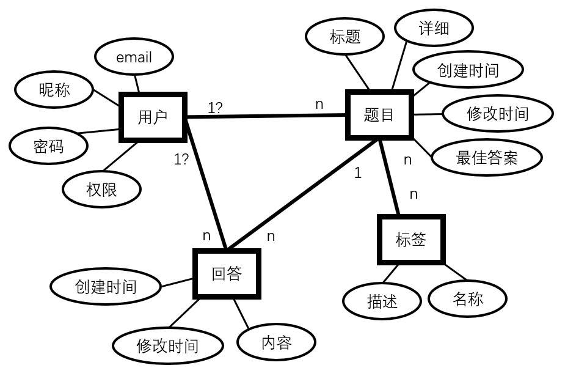
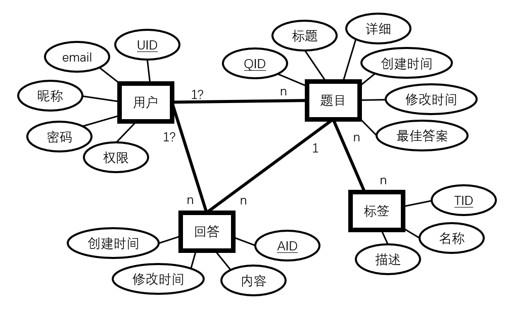

# 数据库设计说明书

## 需要实现的功能

* 存储用户的相关信息，包括用户的邮箱、密码、权限等级，还需要保存用户提出的问题和用户回答的问题；
* 存储问题相关信息，包括问题的题目、详细描述、提问用户、问题的标签、存在的答案、创建时间、最后一次修改时间，如果创建者标记了最佳答案，还需要进行标识；
* 存储回答相关信息，包括回答的内容、回答用户、创建时间、最后一次修改时间；
* 存储标签相关信息，包括标签名和标签的描述；
* 一个用户可以提出多个题目、做出多个回答，一个题目可以有多个回答；
* 一个题目可以有多个标签，一个标签也可以被多个题目使用；
* 用户删除后，其回答和题目仍旧保留，但是需要进行特殊标识能够识别到该问题/回答的创建者已经注销；

## 实体关系分析

简单对上述要求进行抽象，可以得到如下`E-R图`：

其中`用户-题目`、`用户-回答`关系并不是简单的一对多关系，当原先的用户被删除后，题目和回答应该可以单独存在，即对应`0`个用户。

为其添加便于查询的`xID`属性并标记主键后得到如下`E-R图`：

由此，我们整理出所需的关系模式：

1. 用户（UID，email，密码，昵称，权限）
2. 题目（QID，标题，创建者UID，详细，最佳答案的AID，创建时间，修改时间）
3. 回答（AID，所属问题QID，内容，创建者UID，创建时间，修改时间）
4. 标签（TID，名称，描述）
5. 题目-标签（TID，QID）

以上所有关系中除了最后一个都只有第一个属性是键。题目-标签关系中，所有属性共同构成主键，每一个主属性都是外键。

## 关系模式约束

### 1. 用户 user

|属性名|描述|基础类型|额外约束|
|:-|:-|:-|:-|
|UID|用户ID|int|主键，由数据库负责维护，递增|
|email|用户邮箱|varchar(254)|备用键，不能重复，不能更改|
|bcrypt|密文密码|char(len)|由于目前没有确定具体加密算法，所以数据库密码长度暂时未确定|
|name|昵称|varchar(18)|备用键，不能重复，2~18个字符|
|auth|权限|int|1表示用户，2表示管理员|

### 2. 题目 question

|属性名|描述|基础类型|额外约束|
|:-|:-|:-|:-|
|QID|题目ID|int|主键，由数据库负责维护，递增|
|title|标题|varchar(150)|不超过150个字符|
|creater|创建用户|int|可空外键，应当是user关系中存在的UID，当对应的用户被删除时，应由触发器将此项置为空|
|remarks|详细信息|varchar(max)||
|best|最佳答案|int|可空外键，应当是answer关系中存在的AID，且该AID对应的回答的QID必须与本元组相同，当对应回答删除时，应由触发器将此项值为空|
|createTime|创建时间|date|创建此项的时间，由数据库维护，不可更改|
|modifyTime|修改时间|date|每次修改此项应当更新，由数据库维护|

### 3. 回答 answer

|属性名|描述|基础类型|额外约束|
|:-|:-|:-|:-|
|AID|回答ID|int|主键，由数据库负责维护，递增|
|QID|所属问题|int|不可空外键，当QID对应的问题删除后，此项也应当由触发器删除|
|content|回答内容|varvhar(max)||
|creater|创建用户|int|可空外键，应当是user关系中存在的UID，当对应的用户被删除时，应由触发器将此项置为空|
|createTime|创建时间|date|创建此项的时间，由数据库维护，不可更改|
|modifyTime|修改时间|date|每次修改此项应当更新，由数据库维护|

### 4. 标签

|属性名|描述|基础类型|额外约束|
|:-|:-|:-|:-|
|TID|标签ID|int|主键，由数据库负责维护，递增|
|name|名字|varchar(16)|不超过16个字符|
|desc|详细描述|varchar(max)||

### 5. 题目-标签

|属性名|基础类型
|属性名|描述|基础类型|额外约束|
|:-|:-|:-|:-|
|QID|问题ID|int|外键，当QID对应的问题删除后，此项也应当由触发器删除|
|TID|标签ID|int|外键，当TID对应的标签删除后，此项也应当由触发器删除|